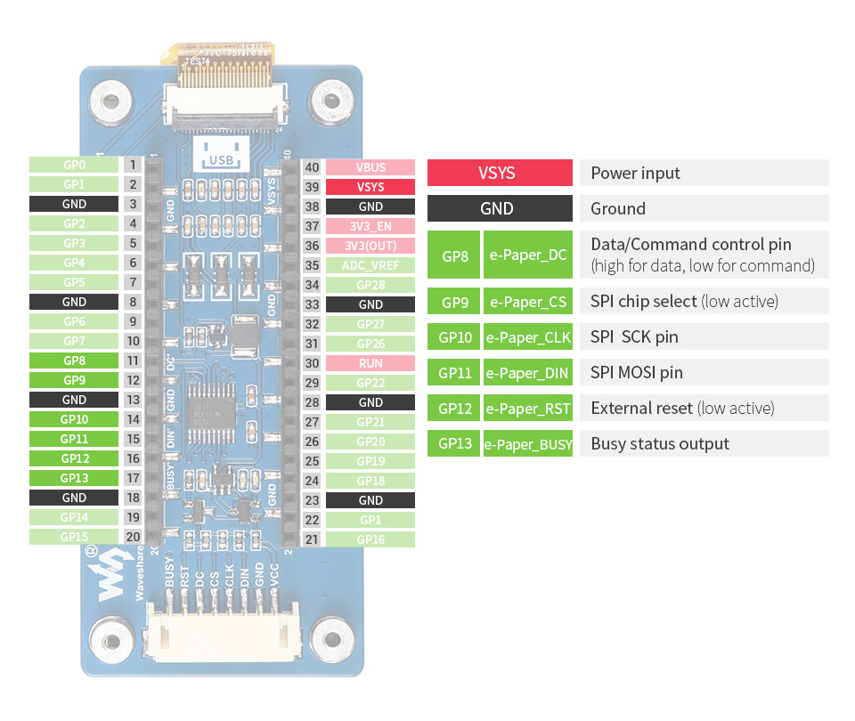

# pico-macro-keyboard
First project using a rpi 2040 on a pico

So, because I know I want some GPIO for at least 4 buttons, I am not going to solder male pin headers to every pin on the pico.

pin 3, pin 23. That uses up 2 ground pins, but these a non-unique.
39 (just under top right)
11-17 ()

Looking at the example.
Pico_ePaper-2.9.py
Pico_ePaper-2.9-B.py (re)
Pico_ePaper-2.9-C.py

B and C seem to be coded for red and black screens.

| PART NUMBER 	| COLORS 	| RESOLUTION 	|
|:-:	|-	|-	|
| Pico-ePaper-2.9 	| black, white 	| 296 × 128 	|
| Pico-ePaper-2.9-B 	| red, black, white 	| 296 × 128 	|

https://www.raspberrypi.org/documentation/rp2040/getting-started/

https://learn.adafruit.com/welcome-to-circuitpython/installing-mu-editor

(https://learn.adafruit.com/welcome-to-circuitpython/installing-circuitpython)
Some of the CircuitPython compatible boards come with CircuitPython installed. Others are CircuitPython-ready, but need to have it installed. As well, you may want to update the version of CircuitPython already installed on your board. The steps are the same for installing and updating. Here we will cover how to install or update CircuitPython on your board.

https://circuitpython.org/board/raspberry_pi_pico/

Downloaded and dropped adafruit-circuitpython-raspberry_pi_pico-en_GB-6.2.0 onto rpi when it appears as device rpi.
It reappears as device pico, and then as CIRCUITPY drive.

https://learn.adafruit.com/welcome-to-circuitpython/the-circuitpy-drive

The CIRCUITPY drive is where your code and the necessary libraries and files will live. You can edit your code directly on this drive and when you save, it will run automatically. 

The demo code I have is micropython not circuit python.

https://blog.adafruit.com/2018/07/31/e-paper-display-driver-code-for-circuitpython-with-a-fractal-demo/

# Micropython setup # 

https://youtu.be/eu4ksKIEf5k

https://www.raspberrypi.org/documentation/rp2040/getting-started/#getting-started-with-micropython

So, I went the micropython route with thonny and the Pico_ePaper-2.9.py example, and the screen displays the example demo.

The demo code extended a class called framebuf

https://docs.micropython.org/en/latest/library/framebuf.html

All characters have dimensions of 8x8 pixels and there is currently no way to change the font.

https://forum.micropython.org/viewtopic.php?f=18&t=6319&sid=b3a986da757addfcebf8b03bbaae7fd4&start=10

I should look at setting up a testable python playpen.

bitlocker
username
pw
keypass
yyvtk password

https://github.com/olikraus/u8g2/issues/318

The LUT contains the display specific waveform for the pixel programming of the display.

https://electronics.stackexchange.com/questions/545758/lut-from-otp-vs-lut-from-register-on-e-paper-displays

Idea of using a rocker switch for up/down/left/right/enter.
Very appealing from a soldering point of view.

Requires 5v input (? maybe get away with 3v? What is the output?) pico is only 3 volt tolerant.

https://shop.pimoroni.com/products/analog-2-axis-thumb-joystick-with-select-button-breakout-board?variant=311234333&currency=GBP&utm_source=google&utm_medium=cpc&utm_campaign=google+shopping?utm_source=google&utm_medium=surfaces&utm_campaign=shopping&gclid=CjwKCAjw7diEBhB-EiwAskVi162LioW5Er9nX6ccUfuBwRu345fiocthPpTp3TpT-VOjfYNxjhyvlRoCe1IQAvD_BwE

Adafruit version is usable up to 5V.
X and Y act like 10k pots.

I can get 5V from the top right pin when powered from USB.

The switch button on the rocker is normally open - connected to ground when pushed. Doesn't seem to have a pull-up?

https://learn.adafruit.com/pro-trinket-usb-hid-mouse/example-joystick-mouse
2-axis joystick connected to pins A0 and A1 with pushbutton on D10

